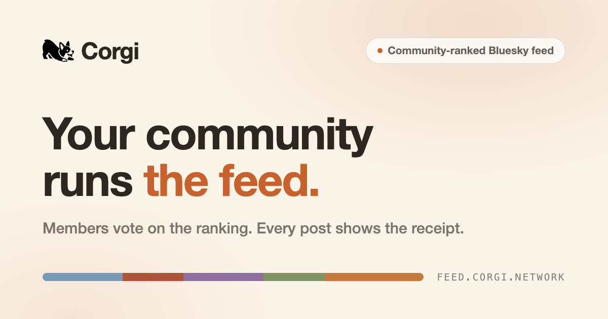
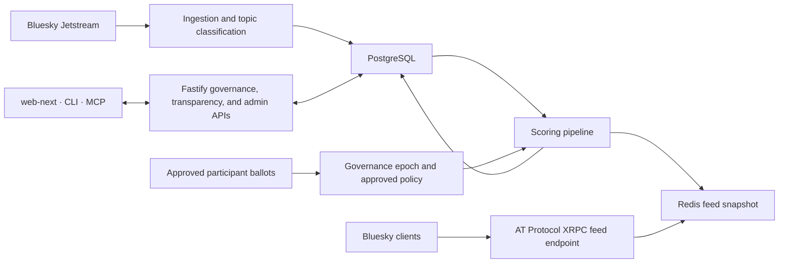

<p align="center">
  <a href="https://feed.corgi.network/">
    
  </a>
</p>

<h1 align="center">Corgi</h1>

<p align="center">
  <strong>A Bluesky feed communities can inspect and shape.</strong>
</p>

<p align="center">
  Community-shaped ranking · Inspectable policy · Reproducible shadow demo
</p>

<p align="center">
  <a href="https://bsky.app/profile/corgi-network.bsky.social/feed/community-gov"><strong>Open Corgi Commons</strong></a>
  ·
  <a href="https://feed.corgi.network/demo/"><strong>Try the demo</strong></a>
  ·
  <a href="https://feed.corgi.network/how-it-works/"><strong>Watch the walkthrough</strong></a>
  ·
  <a href="https://docs.corgi.network/"><strong>Read the docs</strong></a>
</p>

<p align="center">
  <a href="https://github.com/andrewnordstrom-eng/bluesky-community-feed/actions/workflows/deploy.yml"></a>
  <a href="https://github.com/andrewnordstrom-eng/bluesky-community-feed/actions/workflows/ci.yml"></a>
  <a href="https://github.com/andrewnordstrom-eng/bluesky-community-feed/actions/workflows/codeql.yml"></a>
  <a href="LICENSE"></a>
  
  
</p>

Corgi — short for Community-Oriented Recommendation: Governance and Infrastructure — treats a shared recommender as a community resource.

Corgi Commons is a production Bluesky custom feed and a limited governance pilot. Anyone can view the public feed. Approved pilot participants can collectively govern five global ranking signals, topic priorities, and content rules. A closed round is reviewed and approved before its complete policy is applied and the feed is rescored.

Bluesky renders the ordered posts. Corgi provides the governance and explanation layer: the active policy, score decomposition, epoch history, counterfactuals, and available ranking receipts.

> **Research question:** Can a community meaningfully govern its own recommendation algorithm without giving up speed, legibility, or operational control?

## Start Here

| Surface | What it is | Access |
|---|---|---|
| **Corgi Commons** | The live public custom feed served to Bluesky clients | [View or subscribe on Bluesky](https://bsky.app/profile/corgi-network.bsky.social/feed/community-gov) |
| **Shadow governance demo** | An anonymous, isolated replay over a frozen Corgi Commons comparison corpus | [Try the interactive demo](https://feed.corgi.network/demo/) |
| **Product walkthrough** | A 4:14 tour of the governance loop and reviewer-safe demo | [Watch how Corgi works](https://feed.corgi.network/how-it-works/) |
| **Pilot access** | The waitlist for approved production-governance participation | [Request access](https://feed.corgi.network/start/) |
| **Developer documentation** | Public API, architecture, and operating references | [Open docs.corgi.network](https://docs.corgi.network/) |

## Watch the Governance Loop

<p align="center">
  <a href="https://www.youtube.com/watch?v=b1TTIcc5ykU">
    
  </a>
</p>

The published walkthrough follows the complete path from candidate posts to a community ballot, an approved policy, the ordered Bluesky feed, and an inspectable Corgi receipt. The [How Corgi Works](https://feed.corgi.network/how-it-works/) page pairs the video with an interactive policy replay.

## How a Vote Becomes a Feed

1. **Ingest candidates.** Corgi reads public Bluesky activity from Jetstream, persists posts and interactions, and classifies post topics.
2. **Compute reusable signals.** The scorer evaluates each candidate across recency, engagement, bridging, source diversity, and topic relevance.
3. **Collect valid ballots.** Approved participants can vote on global signal weights, topic priorities, include/exclude content rules, or any combination of those channels. A ballot must include at least one channel; a signal-weight vote includes the complete normalized five-weight vector.
4. **Aggregate and review.** Ballots aggregate after the configured voting window. The proposed policy must pass results review and operator approval; a direct transition cannot bypass that lifecycle.
5. **Rescore and publish.** The approved policy becomes a new epoch, the candidate set is rescored, and the current feed snapshot is served through the AT Protocol feed-generator endpoint.
6. **Inspect what happened.** Corgi exposes per-post score components, governance history, feed-level statistics, counterfactual rankings, and an append-only governance audit log.

## What Is Live — and What Is a Demo

| Surface | What the repository supports | Boundary |
|---|---|---|
| **Production feed** | A live Bluesky custom feed backed by Jetstream ingestion, scheduled scoring, PostgreSQL, Redis, and AT Protocol XRPC routes | Viewing is public; production voting is limited to approved pilot participants |
| **Production governance** | Signal, topic, and content-rule ballots with a review-and-approval lifecycle before application | Corgi is a limited pilot, not an open self-serve network of community feeds |
| **Shadow demo** | One reviewer ballot plus 24 deterministic scripted voter archetypes rerank the same frozen comparison corpus | Demo state is isolated in dedicated Redis and never writes production governance, feed state, audit logs, or research exports |
| **Synthetic voters** | Five transparent preference blocs demonstrate aggregation, inertia, and repeatable multi-epoch behavior | They are not LLM agents and are not validated models of human behavior |
| **Ranking explanations** | Corgi shows raw signals, weights, contributions, publication adjustments, provenance, and counterfactuals | Rank badges and receipts are Corgi annotations; they are not native Bluesky UI |
| **Research support** | Participant gating, consent flows, deterministic anonymization, and consent-aware exports | These capabilities make Corgi a research instrument; they are not a claim of completed participant-study results |

The demo contract is deliberately stricter than a marketing mock. It freezes an approved snapshot of published Corgi Commons inputs, holds the comparison corpus constant across shadow epochs, and labels any fallback mechanics fixture. See the [shadow-governance contract](docs/lab/demo-shadow-governance-contract.md) for its endpoints, isolation rules, snapshot gates, and receipt semantics.

## Ranking Model

The current production registry contains five normalized scoring components:

| Component | What it measures | Current method |
|---|---|---|
| **Recency** | How recently a post was created | Exponential decay within the configured scoring window |
| **Engagement** | Likes, reposts, and replies | Log-scaled weighted engagement with diminishing returns |
| **Bridging** | Whether engagement crosses otherwise dissimilar audiences | Average pairwise Jaccard distance between engager follow sets, with an explicit insufficient-evidence state |
| **Source diversity** | Whether one author is dominating a ranking batch | Diminishing score for repeated posts from the same author |
| **Topic relevance** | How well a post's classified topics match community priorities | Confidence-dampened topic-vector relevance against approved topic weights |

Each component first produces a raw score. Corgi multiplies those raw values by the approved signal weights, then sums the weighted contributions into the total score:

```text
total score = Σ(raw component score × approved signal weight)
```

Global signal weights sum to `1.0`. Topic priorities affect the relevance component. Eligibility rules and publication-stage adjustments are applied separately. Corgi persists each component's raw value, approved weight, and weighted contribution so a ranking can be reconstructed rather than merely described.

The scoring contract is registry-driven and extensible. External authors can implement `ScoringComponent` against the public `@corgi/feed-sdk` surface, then follow the [component contribution guide](docs/contributing-scoring-components.md) and [working civility example](examples/civility-component/).

## Architecture



- PostgreSQL is the durable source for posts, governance state, score decomposition, audit data, and research records.
- Redis is the serving layer for the current ranked feed. Anonymous demo sessions use a separate, non-persistent Redis namespace and instance.
- `web-next/` is the canonical public frontend. `web/` is the legacy Vite frontend retained during migration and is still exercised by the full verification gate.

## Repository Map

| Path | Responsibility |
|---|---|
| [`src/ingestion/`](src/ingestion/) | Jetstream ingestion, cursor recovery, content-label filtering, topic classification |
| [`src/scoring/`](src/scoring/) | Component registry, scoring pipeline, persistence, publication ordering |
| [`src/governance/`](src/governance/) | Participant auth, ballots, aggregation, content rules, epoch lifecycle |
| [`src/feed/`](src/feed/) | Fastify server and AT Protocol feed-generator routes |
| [`src/transparency/`](src/transparency/) | Public explanations, statistics, counterfactuals, governance audit views |
| [`src/demo/`](src/demo/) | Isolated deterministic shadow-governance service and frozen release snapshot |
| [`web-next/`](web-next/) | Canonical Next.js public site, demo, voting, and transparency UI |
| [`web/`](web/) | Legacy React/Vite compatibility frontend |
| [`packages/feed-sdk/`](packages/feed-sdk/) | Public scoring-component type surface |
| [`cli/`](cli/) | `feed-cli` operator interface |
| [`docs/`](docs/) | Product, architecture, deployment, operations, security, and research evidence |

## Local Development

### Prerequisites

- Node.js `>=20.19.0`
- Docker with Docker Compose v2.17.0 or newer
- A Bluesky feed identity and app password if you intend to publish or update a feed record

### Install and run

```bash
git clone https://github.com/andrewnordstrom-eng/bluesky-community-feed.git
cd bluesky-community-feed

# The full verification gate covers the backend and both frontends.
npm install
cd web-next
npm install
cd ../web
npm install
cd ..

# Fill every value marked REQUIRED before starting the full service.
cp .env.example .env

# Start local PostgreSQL and the primary Redis instance, then wait for both
# Compose health checks to pass before running migrations.
docker compose up -d --wait --wait-timeout 60 postgres redis

npm run migrate
npx tsx scripts/seed-governance.ts

# Build the canonical static frontend, then serve it from Fastify.
npm --prefix web-next run build
WEB_DIST_DIR=web-next/out WEB_ROUTING_MODE=export npm run dev
```

The base Compose file starts PostgreSQL and the primary Redis instance. Running the anonymous demo locally also requires its isolated Redis instance; its invariants and configuration are documented in the [shadow-governance contract](docs/lab/demo-shadow-governance-contract.md).

### Verify a change

```bash
# Backend, tests, CLI, SDK, legacy web lint/build, and canonical web-next build
npm run verify

# Documentation links, commands, freshness, and repository references
npm run docs:verify

# Useful narrow checks
npm test -- --run
npm --prefix web-next run build
npm run cli -- --help
```

> **Known limitation (2026-07-21):** `npm run docs:verify` exits nonzero on a clean checkout because 12 tracked documents in `docs/freshness.json` exceed the 120-day review window. The command still checks links, commands, and repository references before reporting that repository-wide freshness debt.

## Interfaces

<details>
<summary><strong>Public and authenticated API surfaces</strong></summary>

- **AT Protocol:** `getFeedSkeleton`, `describeFeedGenerator`, and feed interactions under `/xrpc/app.bsky.feed.*`
- **Transparency:** per-post explanations, feed statistics, counterfactuals, and the governance audit log under `/api/transparency/*`
- **Governance:** session auth, ballots, current weights, topic catalog, content rules, epochs, research consent, and waitlist routes under `/api/governance/*`
- **Admin:** protected governance lifecycle, feed health, participant, topic, interaction, and export routes under `/api/admin/*`
- **MCP:** Streamable HTTP admin tooling at `/mcp`
- **OpenAPI:** public reference at [docs.corgi.network](https://docs.corgi.network/); Swagger UI at `/api/docs` is admin-gated in production

</details>

<details>
<summary><strong>Operator CLI</strong></summary>

The CLI uses the same authenticated backend as the web administration surface; it does not require direct VPS access.

```bash
npm run cli -- --help
npm run cli -- epoch status
npm run cli -- votes summary --epoch 1
npm run cli -- feed health
npm run cli -- topics list
```

</details>

## Documentation

| Document | Use it for |
|---|---|
| [`docs/PRD.md`](docs/PRD.md) | Current mission, outcomes, and non-goals |
| [`docs/SYSTEM_OVERVIEW.md`](docs/SYSTEM_OVERVIEW.md) | Deeper system and data-flow tour |
| [`docs/lab/demo-shadow-governance-contract.md`](docs/lab/demo-shadow-governance-contract.md) | Exact public-demo behavior and evidence boundary |
| [`docs/contributing-scoring-components.md`](docs/contributing-scoring-components.md) | Adding a scoring component through the public SDK |
| [`docs/DEPLOYMENT.md`](docs/DEPLOYMENT.md) | Production deployment and rollback |
| [`docs/OPS_RUNBOOK.md`](docs/OPS_RUNBOOK.md) | Operations, health checks, incidents, and recovery |
| [`docs/SECURITY.md`](docs/SECURITY.md) | Security architecture and threat analysis |
| [`SECURITY.md`](SECURITY.md) | Private vulnerability reporting |
| [`CONTRIBUTING.md`](CONTRIBUTING.md) | Contribution and pull-request workflow |
| [`CHANGELOG.md`](CHANGELOG.md) | Released changes |

## Research and Citation

Corgi is an open-source research instrument for studying community-governed recommendation. Its central question is collective rather than individual: how can a community set the objective of a recommender it shares? The system makes the resulting policy, score decomposition, and changes across epochs inspectable while keeping participant consent and export boundaries explicit.

The shadow demo demonstrates the mechanism, not a result about human behavior. One reviewer ballot and 24 deterministic synthetic voters rerank a fixed post set so within-session rank changes can be attributed to policy changes rather than corpus drift. The synthetic electorate is not evidence that the voter archetypes model people or that a human community has reached consensus.

If you use Corgi in research, cite the repository URL and the exact commit SHA used for the analysis. Treat the software's capabilities, the public shadow demo, and any human-study findings as separate claims.

## License

MIT — see [`LICENSE`](LICENSE).
